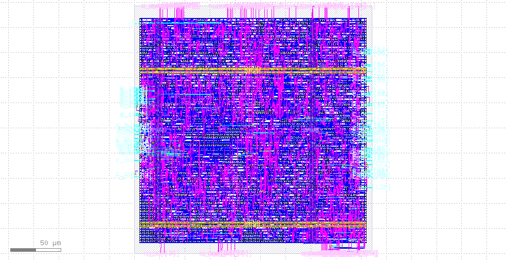
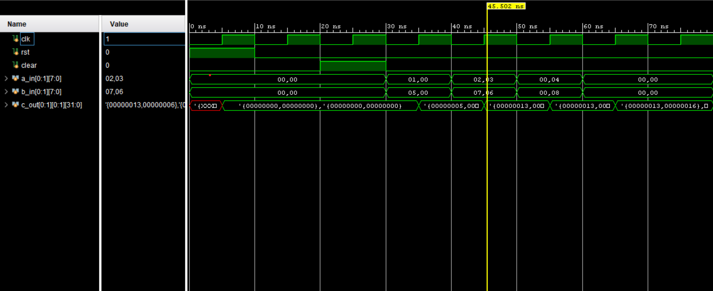

# Parametrized 2D Systolic Array Matrix Multiplication Accelerator

A fully parametrized N×N systolic array hardware accelerator implemented in SystemVerilog, designed for high-throughput matrix multiplication. Taped out as a custom ASIC on the SkyWater 130nm open-source PDK using LibreLane.

**Author:** Faid Faisal | Computer Engineering, Stony Brook University

---

## Table of Contents

- [ASIC Implementation](#asic-implementation)
- [Overview](#overview)
- [The Math](#the-math)
- [How a Systolic Array Works](#how-a-systolic-array-works)
- [Architecture](#architecture)
- [Module Breakdown](#module-breakdown)
- [Parameters](#parameters)
- [Timing & Latency](#timing--latency)
- [Simulation & Testing](#simulation--testing)
- [File Structure](#file-structure)

---

## ASIC Implementation

This design was synthesized and taped out as a custom ASIC using the open-source **[LibreLane](https://librelane.readthedocs.io/en/stable/getting_started/newcomers/index.html)** ASIC implementation flow.

### Layout

<!-- Drop your GDS screenshot or die photo here — replace the path below -->


*GDS layout of the systolic array generated via LibreLane + KLayout*

### Flow

The full RTL-to-GDSII flow followed the standard ASIC design stages as implemented by LibreLane:

| Stage | Tool (via LibreLane) | Description |
|---|---|---|
| Synthesis | Yosys | RTL → gate-level netlist |
| Floorplan | OpenROAD | Die area, pin placement |
| Placement | OpenROAD | Standard cell placement |
| CTS | OpenROAD | Clock tree synthesis |
| Routing | OpenROAD | Global + detailed routing |
| DRC | Magic + KLayout | Design rule checking |
| LVS | Netgen | Layout vs. schematic |
| STA | OpenROAD | Static timing analysis |
| GDSII Export | KLayout | Final layout output |

### What is LibreLane?

[LibreLane](https://librelane.readthedocs.io/en/stable/getting_started/newcomers/index.html) is an open-source infrastructure library for constructing digital ASIC physical implementation flows. It includes a reference flow (`Classic`) built entirely on open-source EDA tools Yosys, OpenROAD, Magic, KLayout, and Netgen all driven from a single `config.json` file. It is the successor to OpenLane and is developed under the FOSSi Foundation.

### Configuration

The design was configured with a `config.json` pointing to the SystemVerilog sources, specifying the top module, clock port, and clock period:

```json
{
  "DESIGN_NAME": "top",
  "VERILOG_FILES": ["dir::pe.sv", "dir::systolic_array.sv", "dir::controller.sv", "dir::top.sv"],
  "CLOCK_PERIOD": 25,
  "CLOCK_PORT": "clk"
}
```

### Implementation Highlights

- **Technology node:** sky130 (SkyWater 130nm open-source PDK)
- **Clock domain:** Single synchronous domain, fully synchronous reset
- **Critical path:** Through the PE multiply-accumulate chain `ACC_WIDTH` and `DATA_WIDTH` directly determine depth
- **Area scaling:** O(N²) each added row/column instantiates N new PEs
- **Back-to-back throughput:** The `clear` signal resets accumulators without a full chip reset, enabling pipelined computation

The fully registered datapath (all PE outputs are flip-flop driven) produces clean timing paths and makes timing closure straightforward with standard-cell synthesis.

### Power, Performance, and Area (PPA)

> Metrics from LibreLane `final/metrics.csv` sky130 PDK, nom_tt_025C_1v80 corner

| Metric | Value |
|---|---|
| Technology | Sky130 (SkyWater 130nm) |
| Die Area | 235.84 × 246.56 µm (~58,148 µm²) |
| Core Area | 50,068 µm² |
| Cell-Area Utilization | 66.9% |
| Standard Cell Count | 3,670 |
| Sequential Cells (Flip-Flops) | 160 |
| Total Instance Count | 8,798 |
| Total Power | 9.82 mW |
| Internal Power | 5.34 mW |
| Switching Power | 4.47 mW |
| Leakage Power | 0.056 µW |
| Setup Worst Slack (tt corner) | +2.045 ns  |
| Hold Worst Slack (tt corner) | +0.339 ns  |
| Setup Violations (tt corner) | 0  |
| Hold Violations (tt corner) | 0  |
| DRC Errors | 0  |
| LVS Errors | 0  |
| Routed Wirelength | 57,363 units |
| Routing DRC Errors (final) | 0  |

---

## Overview

Matrix multiplication is one of the most computationally intensive operations in modern workloads it is the backbone of neural network inference, signal processing, and scientific computing. General-purpose CPUs are inefficient at this because they process data serially; GPUs help but come with significant power and area overhead.

A **systolic array** solves this by distributing computation across a grid of simple Processing Elements (PEs) that pass data rhythmically from one to the next in lockstep with the clock like a heartbeat (hence "systolic"). Data flows through the array without any centralized control, achieving high throughput with minimal memory bandwidth.

This project implements a fully parametrized N×N systolic array in SystemVerilog, capable of computing the product of two N×N signed integer matrices in `3N - 2` clock cycles. It was also synthesized and taped out as a custom ASIC.

---

## The Math

### Matrix Multiplication

Given two N×N matrices **A** and **B**, the output matrix **C** is defined as:

$$C[i][j] = \sum_{k=0}^{N-1} A[i][k] \cdot B[k][j]$$

Each output element C[i][j] is the dot product of row *i* of **A** with column *j* of **B**.

**Example 2×2 case:**

```
A = | 1  2 |      B = | 5  6 |
    | 3  4 |          | 7  8 |

C[0][0] = (1×5) + (2×7) = 19
C[0][1] = (1×6) + (2×8) = 22
C[1][0] = (3×5) + (4×7) = 43
C[1][1] = (3×6) + (4×8) = 50
```

### What Each PE Computes

Every PE sits at grid position (i, j) and computes its partial sum over time:

```
acc_out[i][j] += a_in * b_in    (each clock cycle)
```

After all N input values have streamed through, `acc_out[i][j]` holds the final value of `C[i][j]`.

---

## How a Systolic Array Works

The key insight is **data reuse through pipelining**:

- Row *i* of matrix **A** is fed into the left edge of row *i* of the array.
- Column *j* of matrix **B** is fed into the top edge of column *j* of the array.
- Each PE multiplies its current `a_in` and `b_in`, adds it to its accumulator, then **passes both values to its right and bottom neighbors** on the next clock cycle.

Because data propagates one PE per cycle, inputs must be **skewed** staggered in time so that the right elements meet at the right PE at the right cycle.

### Data Flow Diagram (2×2 example)

```
         b[0]    b[1]
          ↓       ↓
a[0] → [PE00] → [PE01]
          ↓       ↓
a[1] → [PE10] → [PE11]
```

**Cycle-by-cycle skewed input schedule:**

| Cycle | a_in[0] | a_in[1] | b_in[0] | b_in[1] |
|-------|---------|---------|---------|---------|
| 1     | A[0][0] |    0    | B[0][0] |    0    |
| 2     | A[0][1] | A[1][0] | B[1][0] | B[0][1] |
| 3     |    0    | A[1][1] |    0    | B[1][1] |

After cycle 3 (`3×2 - 2 = 4` cycles for N=2... see [Timing](#timing--latency)), every PE's accumulator holds the correct final value of its output element.

---

## Architecture

```
┌──────────────────────────────────────────────┐
│                   top.sv                     │
│                                              │
│   ┌──────────────────────────────────────┐  │
│   │           systolic_array.sv          │  │
│   │                                      │  │
│   │  a_in[0] ──► [PE 0,0] ──► [PE 0,1]  │  │
│   │              (acc 0,0)    (acc 0,1)  │  │
│   │                 │             │      │  │
│   │  a_in[1] ──► [PE 1,0] ──► [PE 1,1]  │  │
│   │              (acc 1,0)    (acc 1,1)  │  │
│   │                                      │  │
│   │  b_in fed in from top of each column │  │
│   └──────────────────────────────────────┘  │
│                                              │
│   c_out[N][N] ← accumulated results         │
└──────────────────────────────────────────────┘
```

The `controller.sv` module manages FSM-based sequencing: it clears accumulators before a new computation, asserts `running` during the compute window, and pulses `done` when results are valid.

---

## Module Breakdown

### `pe.sv` — Processing Element

The atomic compute unit. One instance lives at every grid coordinate (i, j).

| Port      | Direction | Width        | Description                        |
|-----------|-----------|--------------|------------------------------------|
| `clk`     | input     | 1            | Clock                              |
| `rst`     | input     | 1            | Synchronous reset                  |
| `clear`   | input     | 1            | Zero the accumulator               |
| `a_in`    | input     | `DATA_WIDTH` | Left operand from row              |
| `b_in`    | input     | `DATA_WIDTH` | Top operand from column            |
| `a_out`   | output    | `DATA_WIDTH` | Passes `a_in` east to next PE      |
| `b_out`   | output    | `DATA_WIDTH` | Passes `b_in` south to next PE     |
| `acc_out` | output    | `ACC_WIDTH`  | Running accumulation result        |

**Behavior (registered):**
```
acc_out <= acc_out + (a_in * b_in)
a_out   <= a_in     // propagate east
b_out   <= b_in     // propagate south
```

---

### `systolic_array.sv` — N×N PE Grid

Instantiates N² PEs using `generate` loops and wires them together. Boundary conditions:
- Column 0 PEs take `a_in[i]` directly from the top-level input.
- Row 0 PEs take `b_in[j]` directly from the top-level input.
- Interior PEs receive data from their west and north neighbors.

| Port    | Direction | Width              | Description               |
|---------|-----------|--------------------|---------------------------|
| `a_in`  | input     | `N × DATA_WIDTH`   | Row inputs (left edge)    |
| `b_in`  | input     | `N × DATA_WIDTH`   | Column inputs (top edge)  |
| `c_out` | output    | `N × N × ACC_WIDTH`| Full result matrix        |

---

### `controller.sv` — FSM Controller

4-state Moore FSM that sequences a computation:

```
IDLE ──(start)──► CLEAR_ACC ──► COMPUTE ──(cycle_count == 3N-3)──► DONE_STATE ──► IDLE
```

| State       | `clear` | `running` | `done` |
|-------------|---------|-----------|--------|
| IDLE        | 0       | 0         | 0      |
| CLEAR_ACC   | 1       | 0         | 0      |
| COMPUTE     | 0       | 1         | 0      |
| DONE_STATE  | 0       | 0         | 1      |

The compute window lasts exactly `3N - 2` cycles, which is the minimum number of cycles for all partial products to fully propagate through an N×N array.

---

### `top.sv` — Top-Level Wrapper

Ties together `systolic_array` and `controller`. Exposes the full parameter set and the user-facing interface.

---

## Parameters

| Parameter    | Default | Description                                    |
|--------------|---------|------------------------------------------------|
| `N`          | 2       | Array dimension (computes N×N matrix product)  |
| `DATA_WIDTH` | 8       | Bit width of input operands (signed)           |
| `ACC_WIDTH`  | 32      | Bit width of accumulator outputs (signed)      |

**Overflow note:** With 8-bit inputs and N multiply-accumulate operations, the worst-case accumulator value is `N × (2^7)^2 = N × 16384`. A 32-bit accumulator is safe for very large N. Adjust `ACC_WIDTH` if you change `DATA_WIDTH`.

**Scaling:** Changing `N` scales the array linearly in area and achieves the same latency formula. A 4×4 array needs `3×4 - 2 = 10` cycles; an 8×8 needs 22 cycles.

---

## Timing & Latency

Total cycles to complete one N×N matrix multiply:

```
Latency = 3N - 2  cycles
```

| N   | Latency (cycles) |
|-----|-----------------|
| 2   | 4               |
| 4   | 10              |
| 8   | 22              |
| 16  | 46              |

This accounts for the pipeline fill time (N-1 cycles to skew inputs across the first row/column) plus N cycles of computation, plus pipeline drain.

---

## Simulation & Testing

Three testbenches are included:

### `pe_tb.sv`
Unit test for a single PE. Verifies the multiply-accumulate behavior, reset, and clear functionality in isolation.

### `systolic_array_tb.sv`
Integration test for the full array. Drives skewed inputs and checks that all N² output elements match expected values.

### `top_tb.sv`
End-to-end test through the top-level module. Example stimulus for a 2×2 case:

```
A = | 1  2 |    B = | 5  6 |    Expected C = | 19  22 |
    | 3  4 |        | 7  8 |                  | 43  50 |
```

Inputs are fed skewed across three cycles per the systolic schedule, then the output is printed via `$display`.

### Waveform



*Vivado behavioral simulation `rst` deasserts → `clear` pulses → skewed inputs stream in → `c_out` accumulates to final result (0x13=19, 0x16=22, 0x2B=43, 0x32=50)*

**To simulate (e.g. with ModelSim / QuestaSim):**
```bash
vlog pe.sv systolic_array.sv controller.sv top.sv top_tb.sv
vsim -c top_tb -do "run -all; quit"
```

**Or with Icarus Verilog:**
```bash
iverilog -g2012 -o sim pe.sv systolic_array.sv controller.sv top.sv top_tb.sv
vvp sim
```

---

## File Structure

```
.
├── pe.sv                       # Processing Element MAC unit
├── systolic_array.sv           # N×N PE grid (parametrized)
├── controller.sv               # FSM controller (IDLE/CLEAR/COMPUTE/DONE)
├── top.sv                      # Top-level wrapper
├── pe_tb.sv                    # PE unit testbench
├── systolic_arary_tb.sv        # Array integration testbench
├── top_tb.sv                   # Full system testbench
├── custom_ASIC.png             # GDS layout image
├── simulation_waveform.png     # Vivado behavioral simulation waveform
└── config.json                 # LibreLane flow configuration
```

---

## Known Limitations & Future Work

- **Input skewing is manual** the testbenches drive pre-skewed inputs by hand. A real system would include an input skew buffer or DMA controller to handle this automatically.
- **Square matrices only** the current design assumes N×N operands. Rectangular matrix support (M×K × K×N) would require separate row/column dimension parameters.
- **No output buffering** `c_out` is read directly from PE accumulators. A production design would latch results into an output register bank after `done` asserts.
- **Fixed datapath width** `DATA_WIDTH` and `ACC_WIDTH` are set at elaboration time. Runtime-reconfigurable precision (e.g. INT4/INT8 switching) is a natural extension for ML inference workloads.

---

## Conclusion

This project demonstrates a complete hardware accelerator design cycle from mathematical specification to verified RTL to physical silicon. The systolic array architecture delivers high multiply-accumulate throughput with a minimal, regular structure that scales cleanly with the parameter `N`, making it a strong foundation for matrix-heavy workloads like neural network inference and signal processing.

The design was fully verified through unit, integration, and system-level testbenches, then taken through the complete RTL-to-GDSII flow using LibreLane and the open-source sky130 PDK, resulting in a real taped-out ASIC. The fully registered, single-clock-domain datapath made timing closure straightforward, and the parametrized `generate`-based architecture means the same RTL scales from a 2×2 proof-of-concept to larger arrays without any structural changes.

---

*SystemVerilog implementation Parametrized 2D Systolic Array Matrix Multiplication Accelerator*
